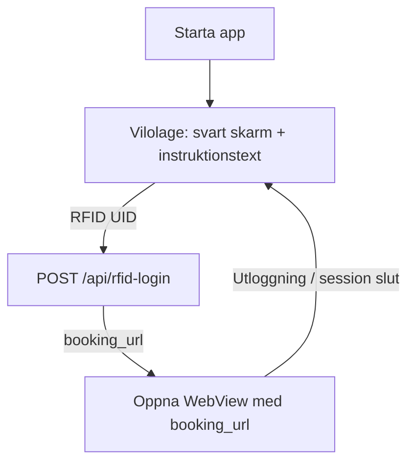

# Android kiosk-flode

Denna fil beskriver flodet for Android-appen som fungerar som kiosk for bokningsportalen.

## Oversikt
- Appen startar i vilolage med svart bakgrund och instruktionstext.
- En RFID-tagg lases och UID skickas till API.
- API svarar med `booking_url` som oppnas i WebView.
- Vid utloggning eller utgangen session atergar appen till vilolage.

## Flode (mermaid)

